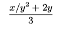

###Упражнение 1.8.
Метод Ньютона для кубических корней основан на том, что если y является приближением к кубическому корню из x, 
то мы можем получить лучшее приближение по формуле

С помощью этой формулы напишите процедуру вычисления кубического корня, подобную процедуре для квадратного корня. 
